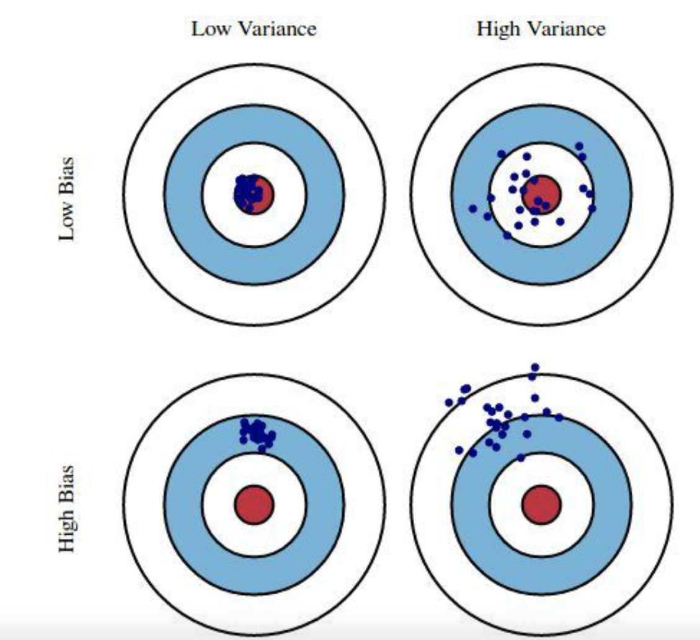

# Setup

```{r setup, include=FALSE}
knitr::opts_chunk$set(echo = TRUE)
library(ISLR2)

library(tidyverse)
library(scales)

library(modelr)
options(na.action = na.warn)

library(broom)
```

# Lab 5.3.1

```{r lab 5.3.1}
set.seed(1)
train <- sample(392, 196) # This takes a sample of 192 numbers from 1:392
model_deg1 <- lm(mpg ~ horsepower, data=Auto, subset=train)
model_deg2 <- lm(mpg ~ poly(horsepower, 2), data=Auto, subset=train)
model_deg3 <- lm(mpg ~ poly(horsepower, 3), data=Auto, subset=train)

mse_test <- function(model, data, train, target) {
  list_of_residuals_squared <- ((target - predict(model, data))[-train])^2 # Exclude the training set and use only the set aside test data (We've segmented the data into [Training | Test], we want Test here)
  mean(list_of_residuals_squared)
}

attach(Auto)
mean((mpg-predict(model_deg1, Auto))[-train]^2) # Mean Squared Error (MSE)
### OR
mse_test(model_deg1, Auto, train, Auto$mpg)
mse_test(model_deg2, Auto, train, Auto$mpg)
mse_test(model_deg3, Auto, train, Auto$mpg)

# Lets try making and testing the model with polynomials up to the 20th degree and plot the MSE

nth_deg_lm_model <- function(target, predictor, data, train, deg) {
  lm(target ~ poly(predictor, deg), data=data, subset=train)
}
mse_list <- replicate(12, 0)
for (i in 1:12) {
  model <- nth_deg_lm_model(Auto$mpg, Auto$horsepower, Auto, train, i)
  mse_list[i] <- mse_test(model, Auto, train, Auto$mpg)
}

mse_df <- as.data.frame(mse_list)
mse_df <- mutate(mse_df, i=1:12) %>%
  rename(mse=mse_list)

mse_df %>%
  ggplot(aes(x=i, y= mse)) +
  geom_line() 


# The model which uses a degree of 20 is crazy so imma check it out
deg20_model <- lm(mpg ~ poly(horsepower, 3), data=Auto, subset=train)

model_predictions_with_data <- Auto[-train,] %>%
  add_predictions(deg20_model)

model_predictions_with_data <- Auto[-train,] %>%
  add_predictions(deg20_model)

model_predictions_with_data %>%
  ggplot(aes(x=horsepower)) +
  geom_point(aes(y=mpg)) +
  geom_line(aes(y=pred))
```

# Lab 5.3.2

In this section we are using glm (generalized linear model)

```{r lab 5.3.2}
library(boot)

glmModel <- glm(mpg ~ horsepower, data = Auto)
coef(glmModel)

cross_validation_error <- cv.glm(Auto, glmModel)
cross_validation_error$delta
# First number is the average mean squared error from doing k-fold cross validation
# Second number is the bias (from not doing LOOCV) corrected version of above
# The default K is the number of observations in the data, making it the LOOCV!
# So in this example the two values should be the same

average_mean_squared_errors <- rep(0, 10)

for (i in 1:10) {
  glmModel <- glm(mpg ~ poly(horsepower, i), data = Auto)
  average_mean_squared_errors[i] <- cv.glm(Auto, glmModel)$delta
}

average_mean_squared_errors <- as.data.frame(average_mean_squared_errors)
average_mean_squared_errors <- average_mean_squared_errors %>%
  mutate(i=1:10)

average_mean_squared_errors %>%
  ggplot(aes(x=i, y=average_mean_squared_errors)) +
  geom_line()
```

# Lab 5.3.3

In this section instead of doing LOOCV, we are actually adjusting the K. This leaves us with however many folds that we set k to. The interesting thing is that as discussed in the comment on line 90, the delta values change now, since before we were doing LOOCV, there was no bias to account for. But now we are doing k-folds which leads to more bias.

What do we mean by bias here?

Bias is how off are we from the actual value vs. Variance is how much we vary from the mean.


